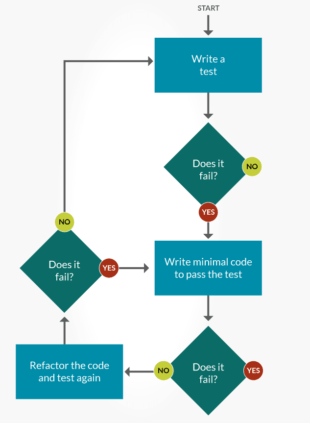
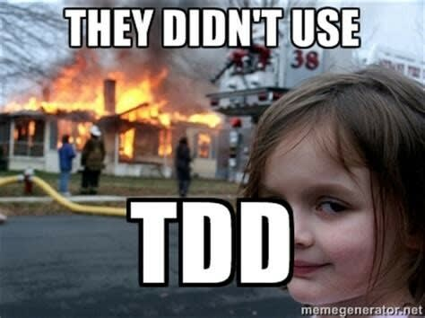
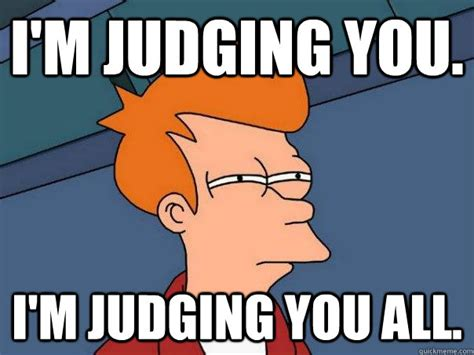

# Object Classes

## Java Classes/Objects
Java is an object-oriented programming language.

Everything in Java is associated with classes and objects, along with its attributes and methods. For example: in real life, a car is an object. The car has attributes, such as weight and color, and methods, such as drive and brake.

A Class is like an object constructor, or a "blueprint" for creating objects.

## Create a Class

To create a class, use the keyword class:

Main.java
Create a class named "Main" with a variable x:

```
public class Main {
  int x = 5;
}
```

## Create an Object

In Java, an object is created from a class. We have already created the class named Main, so now we can use this to create objects.

To create an object of Main, specify the class name, followed by the object name, and use the keyword new:

### Example
Create an object called "myObj" and print the value of x:

```java
public class Main {
  int x = 5;

  public static void main(String[] args) {
    Main myObj = new Main();
    System.out.println(myObj.x);
  }
}
```

## Multiple Objects

You can create multiple objects of one class:

### Example

Create two objects of Main:

```java
public class Main {
  int x = 5;

  public static void main(String[] args) {
    Main myObj1 = new Main();  // Object 1
    Main myObj2 = new Main();  // Object 2
    System.out.println(myObj1.x);
    System.out.println(myObj2.x);
  }
}
```

### Using Multiple Classes
You can also create an object of a class and access it in another class. This is often used for better organization of classes (one class has all the attributes and methods, while the other class holds the main() method (code to be executed)).

Remember that the name of the java file should match the class name. In this example, we have created two files in the same directory/folder:

* Main.java
* Second.java

#### Main.java

```java
public class Main {
  int x = 5;
}
```

#### Second.java

```java
class Second {
  public static void main(String[] args) {
    Main myObj = new Main();
    System.out.println(myObj.x);
  }
}
```

When you run the program the output will be:

```
5
```

## What is TDD

“Test-driven development” refers to a style of programming in which three activities are tightly interwoven: coding, testing (in the form of writing unit tests) and design ( in the form of refactoring)

**Refactoring** -  the process of restructuring computer code without changing or adding to its external behavior and functionality.

**Unit Test** -  the smallest piece of code that can be logically isolated in a system. In most programming languages, that’s a function, sub-routine or method.

## The TDD Process
* Write a test
* Run a test and see if it fails (Yay Failure!!)
* Write code
* Run the tests again (Hopefully it passes)
* Rewrite / Refactor code to make it more efficient
* Run Test again to make sure you didn’t break anything.



[For more on TDD][1]

## F.I.R.S.T

The first acronym is used to make sure that the test we write are following the best practices.

* **F**ast - test should pass or fail quickly
* **I**ndependent -no tests should depend on another test, no class should depend on another class, or external service.
* **R**epeatable - run N times , get the same result N times ( to help isolate bugs and enable automation)
* **S**elf-checking: test can automatically detect if they pass or fail. Test should come to one binary conclusion. Yes or No.
* **T**imely - written about the same time as our code. (This won’t be a problem because we are writing them before we write our code.)


## S.O.L.I.D


* **S**olid - Single responsibility - A program / module / class / method / test should do one thing, and do one thing well.
* **O**pen-Closed - A program / module / class / method / test should be open for extention but closed to modification.
* **L**iskov Substitution - If Object S is a subtype of T, then objects of type T in a program may be replaced with objects of type S without altering any of the desirable properties of that program.
* **I**nterface Segregation - Clients should not be forced to depend on methods that they do not use.
* **D**ependency Inversion - High-level modules should not depend on low-level modules. Both should depend on the abstraction. ( In this case the abstraction is the interface)


## How To Judge Code

One of the most important skills to develop as a engineer, is to be able to consistantly identify what is good or bad code. The way's that we judge if code is crap, is using design patterns, and design principles.

* F.I.R.S.T.
* S.O.L.I.D.

These principles should be the bedrock you use to read / design / and judge not only your code, but any code you choose to use in the future.

Anything you find that isn't accompanied with approrate UNIT Test, should not be trusted.



## What is an Object

At this point you should all know the 3 parts of every object.

* **Id** - its unique space in memory
* **State** - the values that it holds
* **Behavior** - the things you can ask it to do.

I can not overstate how important it is to have this in the back of your head. Everything program is all about creating objects, or collections of objects, and passing those objects around.


Also its important to note Objects will behave differently in different applications, so the passing of Behaviors is also excluded from the RESTful process.

Think of it like this the way you behave at home , is different than the way you would behave at work. ( OR Atleast it SHOULD BE!!)



So the only logical thing that a RESTful application should be passing to an external system is information about the state of a single object or a collection of objects.

## UML

UML - short for Unified Modeling Language, is a standardized modeling language consisting of an integrated set of diagrams, developed to help system and software developers for specifying, visualizing, constructing, and documenting the artifacts of software systems, as well as for business modeling and other non-software systems.

### Types of UML

* Class
* Component
* Deployment
* Object
* Package
* Sequence

We will be focusing on Class diagrams. Before you write any code to truly master the art of TDD, you must have a plan. Once you have your requirements, the next step is to model out your solution. This is done via UML Class Diagrams.

| Symbol | Meaning |
| :------: | :-------: |
|  | Default |
| +       | Public |
| - | Private |
| #| Protected |
| _ | Constructor |
| < > | Interface |

## Let's try it

Complete [Task.java](../src/main/java/com/codedifferently/objectClasses/Task.java)
Complete [TaskTest.java](../src/test/java/com/codedifferently/objectClasses/TaskTest.java)


| Prev                  | TOC                 | Next                                   |
|-----------------------|---------------------|----------------------------------------|
| [Program Control](programControl.md)| [TOC](../ReadMe.md) | [Constructor and Method Overloading](constructorsAndMethodOverloading.md) |